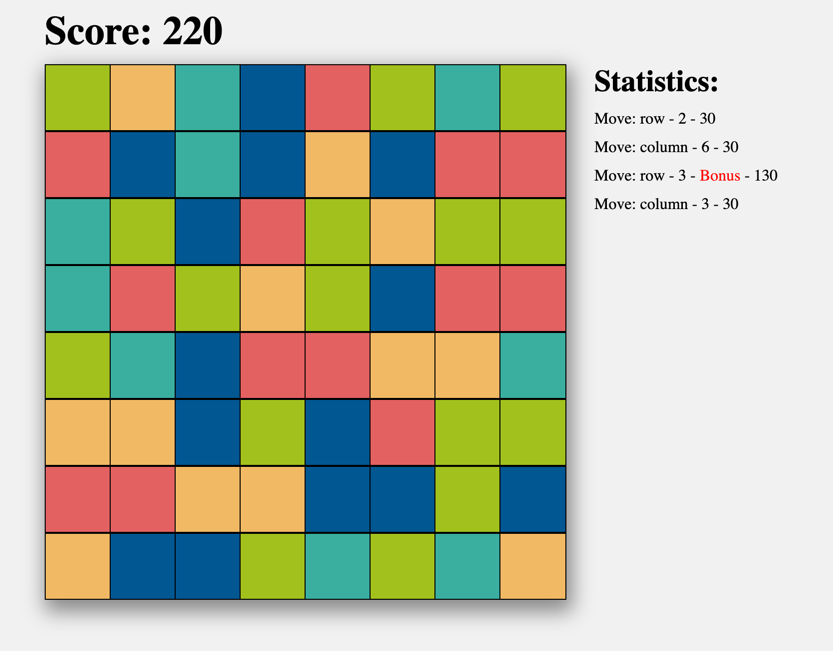

Для запуска игры нужно открыть index.html в браузере.

Для сборки проекта нужно в терминале запустить команды:
- npm install
- webpack

Окружение:
nodejs version >= 20

Условия игры:
- три в линию ячейки, удаляются, но только если их в линию поставил пользователь, иногда, при генерации игрового состояния, ячейки сразу стоят три в линию, но не исчезают
- если больше трех в линию, то строка или столбец полностью удаляются, в случаи столбца все ячейки генерируются заново, в случае строки, строки сверху опускаются

